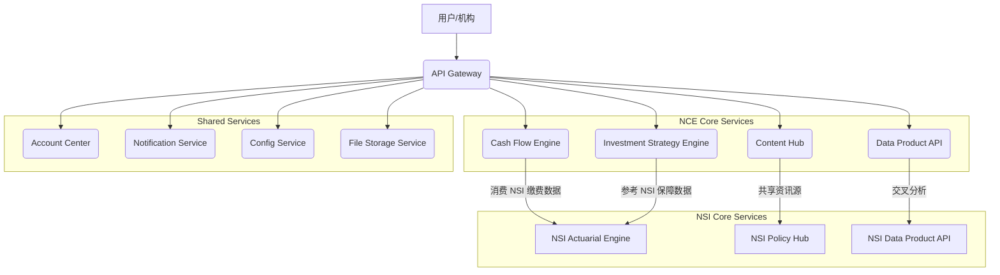

# 产品需求说明书 (PRD)：现金增值引擎 (NeuroCashEngine) v1.0.0

## 1. 引言

### 1.1 产品概述
NeuroCashEngine (NCE) 是一款旨在赋能个人投资者 (C端) 和小微企业主 (B端) 的智能现金增值与管理平台。它将复杂的金融逻辑简化为直观的用户体验，提供从资产配置建议到现金流预测、投资策略制定及数据产品输出的全方位服务。本产品需求说明书 (PRD) 基于 NeuroCashEngine BRD v0.2.0，并参考 NeuroSocialInsurance (NSI) 的微服务架构和多端策略，旨在构建一个技术先进、业务互补的金融科技产品。

### 1.2 产品目标
*   为 C 端用户提供个性化的投资洞察和策略，从基础免费功能到高级增值服务，帮助用户实现资产保值增值。
*   为 B 端用户提供专业的现金流管理和投资策略服务，解决小微企业资金链痛点，提升资金使用效率。
*   通过合规脱敏的数据产品 API，为宏观投研和量化机构提供高价值的微观数据洞察。
*   与 NeuroSocialInsurance (NSI) 产品形成业务互补，NSI 聚焦于社保/医保的“保障”属性和现金流“流出”管理，而 NCE 则侧重于资金的“增值”和现金流“流入/周转”管理，共同构建用户全面的财务健康生态。

### 1.3 术语与缩写
| 术语/缩写 | 解释 |
|---|---|
| NCE | NeuroCashEngine，现金增值引擎 |
| NSI | NeuroSocialInsurance，社保定制速算器 |
| BRD | Business Requirements Document，商业需求文档 |
| PRD | Product Requirements Document，产品需求文档 |
| C端 | Consumer-end，个人用户 |
| B端 | Business-end，企业用户 |
| API | Application Programming Interface，应用程序编程接口 |
| SOP | Standard Operating Procedure，标准化操作程序 |
| PWA | Progressive Web App，渐进式网页应用 |
| MVP | Minimum Viable Product，最小可行产品 |

## 2. 整体架构与技术策略

NCE 将采用与 NSI 类似的微服务架构和多端策略，确保技术栈的统一性、可扩展性和业务的协同性。

### 2.1 微服务架构设计
NCE 的后端将遵循微服务原则，各服务独立部署、独立扩展，并通过 API 网关进行统一管理。核心服务职责如下：

| 服务名称 | 职责描述 | 与 NSI 协同点 |
|---|---|---|
| `account-center` | 用户账户管理、认证授权 (与 NSI 共享) | 统一用户身份，实现 NCE 与 NSI 间的无缝切换和数据共享（如用户基本信息） |
| `cash-flow-engine` | 聚合 C/B 端多账户流水、现金流预测、预警、SOP 生成 | 可消费 NSI 的社保/公积金缴费数据，更精准地预测个人/企业现金流 |
| `investment-strategy-engine` | C 端投资组合生成、高级产品策略推荐、B 端闲置资金投资建议 | 结合 NSI 的社保/医保保障情况，提供更全面的风险评估和投资建议 |
| `content-hub` | 官方/非官方资讯聚合、内容管理、个性化推荐 | 可与 NSI 的 `policy-hub` 共享资讯源，提供更广泛的财经政策解读 |
| `data-product-api` | 脱敏数据处理、API 产品封装与对外提供 | 独立服务，但可将 NCE 和 NSI 的脱敏数据进行交叉分析，提供更丰富的数据产品 |
| `notification-service` | 消息推送、告警通知 (与 NSI 共享) | 统一的通知渠道，向用户推送 NCE 的现金流预警、投资建议等 |
| `config-service` | 系统配置管理 (与 NSI 共享) | 统一管理 NCE 和 NSI 的系统参数、业务规则 |
| `file-storage-service` | 文件存储（如报告、SOP文档）(与 NSI 共享) | 统一存储用户生成的报告、SOP 文档等 |



### 2.2 多端覆盖策略
NCE 将沿用 NSI 的多端矩阵策略，确保用户在不同场景下都能获得一致且优化的体验。所有端将共享核心业务逻辑层 (TypeScript + Zustand + 通用API客户端)，并通过适配层实现各端特性。

| 端 | 技术方案 | 优先级 | 目标用户场景 |
|---|---|---|---|
| **PWA/H5** | Vite + React | P0 | 桌面浏览器、移动端浏览器、快速分享链接 |
| **iOS APP** | Capacitor + iOS原生 | P0 | App Store下载，长期使用，深度用户 |
| **Android APP** | Capacitor + Android原生 | P0 | 应用商店下载，长期使用，深度用户 |
| **微信小程序** | 微信小程序原生开发 | P0 | 微信生态内快速体验，社交分享，轻度用户 |
| **支付宝小程序** | 支付宝小程序原生开发 | P1 | 支付宝生态内体验，与金融/理财入口打通 |

**多端共享架构设计**：
```
┌─────────────────────────────────────────────────────────────┐
│                     共享业务逻辑层                          │
│  (TypeScript + Zustand + 通用API客户端 + 核心金融逻辑)     │
└─────────────────────────────────────────────────────────────┘
                              │
        ┌─────────────────────┼─────────────────────┐
        │                     │                     │
┌───────▼───────┐    ┌────────▼───────┐    ┌──────▼────────┐
│  React Web    │    │ Capacitor      │    │  小程序适配层  │
│  (PWA/H5)     │    │  (iOS/Android)  │    │  (微信+支付宝) │
└───────────────┘    └─────────────────┘    └───────────────┘
        │                     │                     │
   浏览器渲染          原生API桥接          小程序原生能力
   PWA离线存储       推送、生物识别        小程序码、订阅消息
```

## 3. C端用户产品需求 (个人投资者)

### 3.1 基础免费功能

#### 3.1.1 现金、存款、基金、股票四大基本产品投资比例概览
*   **功能描述**：用户通过授权（如银行账户、券商账户、基金平台等 API 接口，或手动录入），系统自动聚合并可视化展示其在现金、存款、基金、股票这四大基本金融产品上的实时投资比例。旨在帮助用户快速了解自身资产配置结构。
*   **用户价值**：提供清晰的资产概览，帮助用户初步识别资产配置的集中度或分散度。
*   **需求点**：
    *   **数据来源**：支持主流银行、券商、基金平台的 API 接入（初期可支持手动录入）。
    *   **可视化**：饼图、柱状图等形式展示各资产类别占比。
    *   **实时性**：数据更新频率可配置（如每日、每周）。
    *   **隐私与安全**：严格遵守数据脱敏和加密原则，确保用户资产信息安全。

#### 3.1.2 央媒等官方渠道时事、财经资讯
*   **功能描述**：聚合来自新华社、人民日报、CCTV财经、证监会、银保监会等官方权威渠道的最新时事与财经新闻。确保信息的权威性、准确性与合规性。
*   **用户价值**：获取可靠、无偏见的官方信息，作为投资决策的基础参考。
*   **需求点**：
    *   **内容聚合**：通过爬虫或官方 API 获取资讯。
    *   **分类与标签**：按时事、财经、政策解读等进行分类，支持关键词搜索。
    *   **信息筛选**：可根据用户关注的领域进行个性化推荐。
    *   **合规声明**：明确标注信息来源为官方渠道。

### 3.2 增值服务功能

#### 3.2.1 非官方但已多渠道交叉验证的最新时事、财经资讯
*   **功能描述**：在官方资讯基础上，进一步整合来自知名财经媒体、独立研究机构、行业专家等非官方但经过多渠道交叉验证的深度时事与财经解读。这些信息将提供更广阔的视角和更深入的分析。
*   **用户价值**：获取更全面、多维度的市场分析和解读，辅助用户形成独立判断。
*   **需求点**：
    *   **内容来源**：扩展至财新、华尔街见闻、雪球等非官方但有影响力的财经媒体和社区。
    *   **交叉验证机制**：系统通过 AI 算法结合人工审核，对非官方信息进行多源比对和真实性评估。
    *   **风险提示**：明确标注信息为非官方，并提示用户自行判断风险。
    *   **专家观点**：可引入特约专家对热点事件进行解读。

#### 3.2.2 高级产品投资比例组合及具体投资标的、各标的投资策略和交易方案
*   **功能描述**：针对债券、贵金属、期货、REITS 等高级金融产品，基于用户的风险偏好、资金量、投资期限等因素，智能生成定制化的投资比例组合建议，并提供具体投资标的、详细投资策略和可执行的交易方案。
*   **用户价值**：降低高级金融产品的投资门槛，提供专业级的投资指导，帮助用户拓展投资边界。
*   **需求点**：
    *   **风险偏好评估**：通过问卷或行为分析，建立用户风险画像。
    *   **高级产品覆盖**：支持债券（国债、企业债）、贵金属（黄金 ETF、实物金）、期货（商品期货、股指期货）、REITS 等。
    *   **智能组合推荐**：基于现代投资组合理论 (MPT) 和用户画像，生成最优资产配置比例。
    *   **具体标的推荐**：提供市场主流、流动性好的具体投资标的列表，并附带基本面分析和技术分析。
    *   **投资策略**：包括但不限于入场时机、持仓周期、止盈止损点、风险管理建议、资金管理等。
    *   **交易方案**：将策略转化为具体操作步骤，指导用户通过合作券商/银行 APP 或第三方交易平台进行操作（初期不直接提供交易功能，仅提供指引）。
    *   **与 NSI 协同**：在生成投资组合时，可参考 NSI 提供的用户社保/医保保障情况，将其纳入整体风险评估，提供更稳健的财务规划。

## 4. B端用户产品需求 (小微企业主)

### 4.1 现金流管理

#### 4.1.1 多账户聚合与实时视图
*   **功能描述**：通过授权，聚合企业在不同银行（对公、对私）、支付平台（支付宝、微信支付）的资金流水，提供实时的、穿透式的现金流总览视图。
*   **用户价值**：解决公私账户混同问题，帮助企业主全面掌握资金状况，消除现金流盲区。
*   **需求点**：
    *   **数据来源**：支持主流商业银行企业网银 API、支付宝/微信支付商户平台 API 接入。
    *   **聚合展示**：统一的 Dashboard 界面，展示所有账户余额、收支明细。
    *   **分类与标签**：自动识别收支类型（如工资、采购、销售回款），支持自定义标签。
    *   **实时更新**：数据更新频率可配置，支持手动刷新。

#### 4.1.2 智能预测与预警
*   **功能描述**：基于至少3个月的历史流水数据，结合企业经营规律（如税期、发薪日、大额应收应付），精准预测未来3-6个月的现金流低谷与高峰。系统将设置硬性阈值，提供7x24小时的资金缺口或盈余告警。
*   **用户价值**：提前预知资金风险，避免资金链断裂，优化资金调度。
*   **需求点**：
    *   **预测模型**：基于机器学习算法，结合历史数据和预设事件（如合同付款日、税费缴纳日）进行预测。
    *   **告警机制**：支持 App 推送、短信、邮件等多种告警方式，可自定义告警阈值。
    *   **可视化**：折线图展示未来现金流预测曲线，标注风险点。
    *   **与 NSI 协同**：可消费 NSI 提供的企业社保/公积金缴费数据，将其作为固定支出纳入现金流预测模型，提高预测准确性。

#### 4.1.3 资金调拨 SOP 生成
*   **功能描述**：当预测到资金缺口或盈余时，系统将自动生成详细、无技术门槛的标准化操作程序 (SOP) 文档，指导企业出纳或行政人员进行资金调拨（如提前赎回理财、短期借款、闲置资金归集等）。
*   **用户价值**：降低财务操作门槛，确保资金调拨的规范性与及时性，减少人为失误。
*   **需求点**：
    *   **SOP 模板库**：预设多种资金调拨场景的 SOP 模板。
    *   **智能填充**：根据预测结果和企业实际情况，自动填充 SOP 中的关键信息（如金额、时间、操作步骤）。
    *   **导出与分享**：支持 PDF、Markdown 等格式导出，方便打印或分享。
    *   **操作指引**：SOP 包含清晰的步骤、截图或图示，确保基层人员可按图索骥。

### 4.2 无保留的投资及策略管理

#### 4.2.1 企业闲置资金投资建议
*   **功能描述**：针对企业账户中的闲置资金，系统将根据企业的风险承受能力、资金使用周期等因素，提供定制化的投资建议，涵盖短期理财、结构性存款、低风险债券等，旨在在保证资金安全的前提下实现最大化增值。
*   **用户价值**：提升企业闲置资金的收益率，优化资产配置，降低资金沉淀成本。
*   **需求点**：
    *   **企业风险评估**：通过问卷或财务数据分析，评估企业风险承受能力。
    *   **产品推荐**：推荐符合企业风险偏好和流动性需求的金融产品。
    *   **收益测算**：提供预期收益率、风险等级、流动性等关键指标。

#### 4.2.2 策略生成与执行指导
*   **功能描述**：为企业提供可执行的投资策略，包括但不限于资金配置比例、具体金融产品选择、风险控制措施等。系统将指导企业用户如何将这些策略应用于实际操作，并提供必要的交易方案。
*   **用户价值**：帮助企业主系统性地管理投资，避免盲目决策，提高投资成功率。
*   **需求点**：
    *   **策略模板**：提供多种投资策略模板（如保守型、稳健型）。
    *   **定制化**：支持企业根据自身情况调整策略参数。
    *   **执行指引**：提供详细的交易操作步骤和注意事项。

#### 4.2.3 投资组合监控与调整
*   **功能描述**：持续监控企业投资组合的表现，并根据市场变化、企业资金状况等因素，及时提供调整建议，确保投资策略的有效性和适应性。
*   **用户价值**：动态管理投资组合，及时应对市场变化，降低投资风险。
*   **需求点**：
    *   **实时监控**：展示投资组合的实时收益、持仓情况。
    *   **预警通知**：当投资组合偏离预设目标或市场发生重大变化时，及时发出预警。
    *   **调整建议**：提供再平衡、止盈止损等调整建议。

## 5. 数据产品 API 需求

### 5.1 脱敏与API集市
*   **功能描述**：在严格遵守 k-匿名性与 l-多样性的前提下，将沉淀的 C 端行为数据（如投资偏好、产品关注度、资讯阅读习惯）与 B 端现金流数据（如资金周转率、行业支付链特征）进行深度脱敏、聚合与分析。
*   **用户价值**：为宏观投研机构、量化基金、商业银行等 B 端客户提供高价值的微观、高频、多维度数据洞察，实现数据二次变现。
*   **需求点**：
    *   **脱敏算法**：采用先进的差分隐私、k-匿名性、l-多样性等技术确保数据隐私。
    *   **数据聚合**：对原始数据进行清洗、转换、聚合，形成有价值的数据集。
    *   **API 网关**：统一管理所有数据 API 的访问、认证、限流。

### 5.2 数据产品 API 列表

| API 名称 | 描述 | 潜在应用场景 |
|---|---|---|
| `C-end Investment Sentiment Index API` | 反映不同资产类别（股、债、金、现）的散户情绪热力与资金流向。 | 市场情绪分析、量化策略因子、风险预警 |
| `B-end Cash Flow Velocity API` | 提供特定行业或区域小微企业的平均资金周转速度与流动性健康度。 | 行业景气度分析、信贷风险评估、供应链金融 |
| `Regional Consumption Vitality Index API` | 结合 C 端与 B 端数据，反映特定区域的消费活跃度与经济景气度。 | 区域经济分析、商业选址、消费趋势预测 |
| `Product Preference & Risk Profile API` | 提供匿名化的用户投资产品偏好分布与风险画像特征。 | 金融产品设计、精准营销、用户行为研究 |
| `NSI-NCE Cross-Data API` | 结合 NSI 的社保/医保数据与 NCE 的金融数据，提供更全面的用户财务健康画像。 | 综合金融服务、精准客户分层、风险管理 |

### 5.3 API 接口规范
*   **认证**：OAuth2.0 或 API Key。
*   **数据格式**：JSON。
*   **限流**：根据订阅级别设置不同的调用频率限制。
*   **文档**：提供详细的 API 文档、示例代码和错误码说明。

## 6. 商业化逻辑 (基于 BRD v0.2.0)

NCE 将采用“三级火箭”变现模型，辅以裂变机制和数据产品订阅服务。

### 6.1 基础引流层 (获客)
*   免费提供 C 端四大基本产品投资比例展示和官方渠道时事、财经资讯。
*   免费提供 B 端单账户流水可视化分析。

### 6.2 核心变现与裂变层 (LTV 挖掘)
*   **C端增值服务订阅**：针对多渠道交叉验证资讯、高级产品投资组合及策略交易方案，采用订阅制或按次付费模式。
*   **B端增值服务订阅**：针对现金流管理与无保留的投资及策略管理服务，采用企业级订阅模式，根据服务深度和企业规模收取年费或月费。
*   **积分驱动的自发裂变**：建立“1积分=1元”的硬通货体系，通过推荐返佣机制驱动用户自发裂变。

### 6.3 数据溢价层 (利润放大器)
*   **数据产品 API 订阅服务**：面向机构销售脱敏后的 C 端行为数据与 B 端现金流数据加工而成的 API 产品订阅服务，提供按调用量、数据维度或订阅周期计费的灵活方案。

## 7. 非功能性需求

### 7.1 性能
*   **响应时间**：核心功能（如资产概览、现金流预测）页面加载时间 ≤ 2秒，API 响应时间 ≤ 500毫秒。
*   **并发能力**：支持至少 10,000 并发用户。
*   **数据处理**：C 端资产数据更新在 1 小时内完成，B 端现金流预测在 5 分钟内完成。

### 7.2 安全性
*   **数据加密**：所有敏感数据（用户资产信息、交易数据）均采用传输加密 (HTTPS) 和存储加密。
*   **权限管理**：严格的用户权限控制，遵循最小权限原则。
*   **漏洞防护**：定期进行安全审计和渗透测试，防范 OWASP Top 10 风险。
*   **合规性**：遵守《网络安全法》、《数据安全法》、《个人信息保护法》等相关法律法规。

### 7.3 可靠性与可用性
*   **可用性**：系统可用性达到 99.9% (年停机时间不超过 8.76 小时)。
*   **容灾备份**：关键数据异地多活备份，确保数据不丢失。
*   **故障恢复**：具备快速故障检测和自动恢复能力。

### 7.4 可扩展性
*   **微服务架构**：支持独立服务水平扩展。
*   **弹性伸缩**：根据业务负载自动调整资源。
*   **开放平台**：预留 API 接口，方便未来与其他金融服务或第三方平台集成。

### 7.5 易用性
*   **用户界面**：简洁直观，符合主流设计规范。
*   **操作流程**：清晰流畅，减少用户学习成本。
*   **反馈机制**：提供及时、明确的操作反馈和错误提示。

## 8. 实施优先级与里程碑 (MVP)

### 8.1 MVP 范围
NCE 的 MVP 将聚焦于 C 端的基础免费功能和部分增值服务，以及 B 端的核心现金流管理功能，并初步搭建数据产品 API 框架。

#### 8.1.1 C端 MVP
*   **基础免费功能**：
    *   四大基本产品投资比例概览（支持手动录入，预留 API 接入接口）。
    *   央媒等官方渠道时事、财经资讯聚合与展示。
*   **增值服务**：
    *   非官方但已多渠道交叉验证的最新时事、财经资讯（初期人工审核为主）。

#### 8.1.2 B端 MVP
*   **现金流管理**：
    *   多账户聚合与实时视图（支持手动录入，预留 API 接入接口）。
    *   智能预测与预警（基于简单模型，告警方式为 App 推送）。
    *   资金调拨 SOP 生成（基础模板）。

#### 8.1.3 数据产品 API MVP
*   初步搭建 `data-product-api` 服务框架。
*   提供 `C-end Investment Sentiment Index API` 的基础版本（基于有限脱敏数据）。

### 8.2 多端 MVP
*   **PWA/H5**：实现 C 端和 B 端 MVP 功能。
*   **iOS/Android APP (Capacitor)**：实现 C 端和 B 端 MVP 功能。

### 8.3 里程碑
| 里程碑 | 目标 | 交付物 |
|---|---|---|
| **M1** | 完成核心微服务架构搭建、账户体系与多端基础框架。 | `account-center`、`config-service`、`notification-service` 部署，PWA/iOS/Android APP 基础壳体上线。 |
| **M2** | 完成 C 端基础免费功能和部分增值服务 MVP。 | C 端资产概览、官方/非官方资讯功能上线。 |
| **M3** | 完成 B 端核心现金流管理 MVP。 | B 端多账户聚合、现金流预测与预警、SOP 生成功能上线。 |
| **M4** | 完成数据产品 API MVP。 | `C-end Investment Sentiment Index API` 对外发布。 |

## 9. 附录

### 9.1 交互原型 (Interactive Prototype)
NCE 的交互设计沿用 NSI 的卡片式布局和渐进式信息展示原则，以下为核心页面的结构与交互说明：

#### 9.1.1 C端：个人资产概览页 (Dashboard)
*   **页面布局**：
    *   **顶部信息卡**：展示“总资产(脱敏/明文切换)”、“昨日收益”、“累计收益”。
    *   **核心图表区**：展示四大基本产品（现金、存款、基金、股票）的资产分布环形图。中心显示总金额，点击各环段可高亮下方对应的明细列表。
    *   **快捷操作栏**：包含一键同步（API抓取）、手动记账、财务健康体检（联动 NSI 接口）。
    *   **信息流区 (Feed)**：官方/非官方财经资讯滚动列表。
*   **核心交互**：
    *   **授权同步流**：点击“绑定新账户”弹出底部半屏抽屉，展示支持的银行/券商列表，点击后跳转至第三方 OAuth 授权页，完成后返回并展示同步动画。
    *   **资讯交叉验证**：点击带有“交叉验证”标签的非官方资讯，展开底部面板展示各方观点对比（如：看多、看空、中立）及 AI 信誉评级。

#### 9.1.2 C端：高级投资策略页 (Strategy)
*   **页面布局**：采用三栏/上下分层式（Pad端三栏，手机端上下滑动）。
    *   **风险画像区**：雷达图展示用户的风险偏好、流动性需求、投资经验。
    *   **推荐组合区**：基于 MPT 模型的资产配置建议饼图（如：30%固收+50%权益+20%大宗）。
    *   **执行方案区 (SOP)**：具体标的卡片（包含代码、名称、预期收益、建议买入区间）。
*   **核心交互**：
    *   **参数微调滑块**：用户可拖动“预期收益”或“最大回撤”滑块，上方的推荐组合和下方的具体标的会实时联动重算。
    *   **模拟交易一键导入**：点击“去模拟”可将当前策略的参数一键带入沙盘进行历史回测。

#### 9.1.3 B端：企业现金流管理页 (Cash Flow)
*   **页面布局**：
    *   **顶栏告警横幅**：当预测到资金缺口时，出现醒目的红色横幅（例如：“⚠️ 预警：预计 15 天后存在 20 万元资金缺口”）。
    *   **资金日历/预测图表**：折线图（历史实际流水）平滑过渡到虚线图（未来 3-6 个月预测流水）。图表上以标记点 (Marker) 标出税期、发薪日等大额支出节点。
    *   **SOP 应对建议区**：横向滑动的解决方案卡片（如：方案A：短期理财赎回；方案B：供应链金融借款）。
*   **核心交互**：
    *   **SOP 生成与导出**：点击某一解决方案，弹出抽屉展示详细操作步骤，支持一键生成 PDF 或发送至行政人员微信/邮箱。

### 9.2 视觉设计稿 (Visual Design Guidelines)
NCE 的视觉设计与 NSI 保持品牌一致性（相同的 Design Token），但更强调“财富增值”与“数据专业感”。

*   **设计主题 (Themes)**：
    *   **暗黑金融终端 (Dark Mode, 默认)**：背景深邃黑/深蓝，强调图表的专业度与沉浸感，降低长时间盯盘的视觉疲劳。适合深度用户和 B 端分析场景。
    *   **浅色友好主题 (Light Mode)**：背景纯白/极光灰，清爽简洁，降低小白用户的认知压力。适合 C 端轻度用户。
*   **色彩规范 (Color Palette)**：
    *   **品牌主色**：科技蓝 (Tech Blue)，传达安全、信任、智能。
    *   **辅助色/点缀色**：财富金 (Wealth Gold)，用于 VIP 标识、高级增值服务推荐、重点收益数字。
    *   **语义色 (严格遵循国内金融习惯)**：
        *   涨/盈余/告警：中国红 (Red)。注：在 B 端现金流断裂告警时也使用警示红。
        *   跌/亏损/安全：环保绿 (Green)。
*   **排版与字体 (Typography)**：
    *   **数据字体**：采用等宽数字字体 (如 DIN Alternate 或 Roboto Mono)，确保账单流水、股价、收益率对齐，提升专业感和可读性。
    *   **文本字体**：系统默认无衬线体 (PingFang SC, San Francisco, Microsoft YaHei)。
*   **数据可视化 (Data Visualization)**：
    *   避免过度装饰，使用平滑的贝塞尔曲线展示现金流预测。
    *   复杂图表（如 MPT 投资组合模型）支持手势缩放 (Pinch-to-zoom) 和长按出现十字光标 (Crosshair) 查看精确数值。

### 9.3 数据字典 (Data Dictionary)
本部分定义 NCE 系统的核心业务数据表结构，作为 `cash-flow-engine` 和 `investment-strategy-engine` 的底层数据支撑。

#### 表1：nce_user_asset_account (用户/企业资产账户表)
用于统一管理 C 端和 B 端通过 API 授权或手动录入的各类金融账户。

| 字段名 | 类型 | 必填 | 描述 | 关联 |
|---|---|---|---|---|
| account_id | VARCHAR(32) | Y | 账户唯一标识 (主键) | - |
| user_id | VARCHAR(32) | Y | 用户 ID (C端/B端统一ID) | account-center |
| account_type | TINYINT | Y | 账户类型：1-银行, 2-券商, 3-基金, 4-微信/支付宝 | - |
| institution_code | VARCHAR(64) | N | 机构代码 (如 ICBC, ALIPAY) | - |
| balance | DECIMAL(18,4) | Y | 当前账户余额 (加密存储) | - |
| currency | VARCHAR(8) | Y | 币种 (如 CNY, USD) | - |
| auth_status | TINYINT | Y | 授权状态：0-失效, 1-有效, 2-手动录入 | - |
| last_sync_time | DATETIME | N | 最后一次 API 同步时间 | - |

#### 表2：nce_cash_flow_record (现金流流水表)
记录所有账户的收支明细，是进行现金流预测和画像分析的基础。

| 字段名 | 类型 | 必填 | 描述 | 关联 |
|---|---|---|---|---|
| record_id | VARCHAR(32) | Y | 流水记录唯一标识 (主键) | - |
| account_id | VARCHAR(32) | Y | 所属账户 ID | nce_user_asset_account |
| trade_time | DATETIME | Y | 交易发生时间 | - |
| amount | DECIMAL(18,4) | Y | 交易金额 (正为入账，负为出账) | - |
| trade_type | VARCHAR(32) | Y | 交易类型 (如 消费, 工资, 理财, 贷款) | - |
| counterparty | VARCHAR(128) | N | 交易对手方名称 | - |
| ai_category_id | INT | N | AI 智能分类标签 ID | - |

#### 表3：nce_investment_product (金融产品基础库)
用于 C 端高级策略和 B 端闲置资金推荐的标的库。

| 字段名 | 类型 | 必填 | 描述 | 关联 |
|---|---|---|---|---|
| product_id | VARCHAR(32) | Y | 产品唯一标识 (主键) | - |
| product_code | VARCHAR(32) | Y | 外部标准代码 (如 股票代码, 基金代码) | - |
| product_name | VARCHAR(128) | Y | 产品名称 | - |
| asset_class | TINYINT | Y | 大类资产：1-现金/货币, 2-固收/债券, 3-权益, 4-大宗/另类 | - |
| risk_level | TINYINT | Y | 风险评级 (R1-R5) | - |
| min_investment | DECIMAL(18,2) | Y | 起投金额 | - |
| expected_roi | DECIMAL(8,4) | N | 预期年化收益率 (%) | - |
| liquidity_days | INT | N | 流动性/锁定期 (天) | - |

#### 表4：nce_cash_flow_forecast (B端现金流预测结果表)
存储引擎每日计算出来的企业未来现金流预测结果，用于预警和生成 SOP。

| 字段名 | 类型 | 必填 | 描述 | 关联 |
|---|---|---|---|---|
| forecast_id | VARCHAR(32) | Y | 预测记录唯一标识 (主键) | - |
| user_id | VARCHAR(32) | Y | 企业主用户 ID | - |
| forecast_date | DATE | Y | 预测目标日期 (如未来某一天) | - |
| predicted_balance | DECIMAL(18,4) | Y | 预测当日终结存余额 | - |
| is_alert | BOOLEAN | Y | 是否触发缺口预警阈值 | - |
| generated_sop_id | VARCHAR(32) | N | 关联的资金调拨 SOP 文档 ID | file-storage-service |

### 9.4 引用文献
*   [1] NeuroCashEngine BRD v0.2.0 (内部文档)
*   [2] PRD修订方案V1.1.0→V1.3.0.md (NSI 产品，内部文档)
